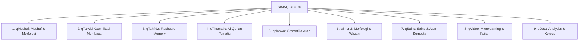
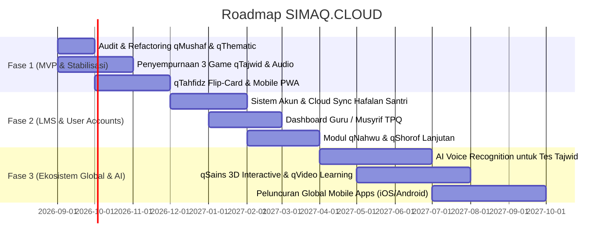

# Product Requirements Document (PRD)
# SIMAQ.CLOUD — The Interactive Quranic Learning Ecosystem

**Dokumen Versi:** 1.0.0  
**Status:** Approved / Living Document  
**Tanggal:** September 2026  
**Domain Target:** `https://simaq.cloud` (dan `https://www.simaq.cloud`)  
**Penulis:** Product & Engineering Team  

---

## 1. Executive Summary & Product Vision

### 1.1 Visi Produk
Menjadi **ekosistem pembelajaran Al-Qur'an digital nomor 1 di dunia** yang menggabungkan kedalaman ilmu tradisional Islam (*turats*) dengan teknologi modern (gamifikasi, analisis linguistik komputasional, dan pengalaman multimedia interaktif).

### 1.2 Tagline & Brand Identity
> **"Gerbang Pembelajaran Al-Qur’an Interaktif — Satu Platform dengan Sembilan Pintu Ilmu."**

### 1.3 Value Proposition
1. **Holistik ("Sembilan Pintu Ilmu"):** Tidak hanya menyajikan mushaf digital biasa, namun mencakup: Tajwid, Tahfidz, Nahwu, Shorof, Mushaf Morfologi, Data/Korpus, Video Pembelajaran, Sains & Tadabbur, serta Tematis.
2. **Gamified & Engaging:** Mengubah proses belajar tajwid dan hafalan yang biasanya monoton menjadi pengalaman interaktif berbasis flip-cards, mini games (letup balon, susun kata, drag-and-drop).
3. **Analisis Morfologi Mendalam (Kata per Kata):** Membantu umat memahami bahasa Al-Qur'an hingga ke akar kata (*root word*), jenis dhomir, i'rab, dan wazan shorof secara visual.
4. **Al-Qur'an Tematis Kontekstual:** Menghubungkan ayat-ayat dengan topik kehidupan kontemporer, sains, akidah, akhlak, dan hukum lengkap dengan audio dwibahasa (Arab dan terjemahan suara).

---

## 2. Problem Statement & Market Analysis

### 2.1 Masalah Pengguna (User Pain Points)
1. **Belajar Al-Qur'an Terfragmentasi:** Pengguna harus menginstal 4–6 aplikasi berbeda (satu untuk murottal, satu untuk tajwid, satu untuk hafalan, satu untuk kamus bahasa Arab, satu untuk tafsir tematis).
2. **Tingkat Kebosanan Tinggi pada Pemula:** Metode belajar membaca huruf hijaiyah dan tajwid konvensional seringkali membosankan anak-anak maupun mualaf/dewasa pemula.
3. **Hafalan Cepat Lupa & Tanpa Pemahaman:** Penghafal sering menghafal suara tanpa mengerti arti kata per kata (*Word-by-Word/WBW*), sehingga sulit memperkuat memori jangka panjang (*mutqin*).
4. **Bahasa Arab Qur'ani Dianggap Sulit:** Ilmu Nahwu dan Shorof sering dianggap momok yang rumit dan hanya bisa dipelajari santri pondok bertahun-tahun melalui kitab kuning tanpa visualisasi modern.
5. **Kesulitan Menemukan Dalil Ayat Tematis:** Mencari panduan Al-Qur'an untuk masalah hidup spesifik (misal: etika berbisnis, parenting, kesehatan mental, alam semesta) membutuhkan pencarian indeks manual yang melelahkan.

### 2.2 Solusi SIMAQ.CLOUD
Platform web & cloud multi-platform yang menyatukan seluruh kebutuhan di atas ke dalam antarmuka yang elegan, cepat, mendukung dark mode, mobile-first, dan dapat diakses gratis oleh umat di seluruh dunia.

---

## 3. Target Audience & User Personas

| Persona | Profil & Kebutuhan | Fitur Utama yang Digunakan |
| :--- | :--- | :--- |
| **Persona 1: Ahmad (Santri & Penghafal Mandiri)** | Usia 17-25 tahun. Sedang menempuh program tahfidz. Butuh latihan daya ingat kata per kata dan pelacak progres juz. | **qTahfidz** (Flip Card), **qMushaf** (Morfologi kata), Progress Tracker Juz 1-30. |
| **Persona 2: Fatimah (Profesional Muda / Mualaf)** | Usia 28 tahun. Sudah bisa baca Al-Qur'an dasar tapi ingin mendalami arti dan tata bahasa Arab Al-Qur'an secara mandiri di waktu luang. | **qNahwu**, **qShorof**, **qThematic** (Tadabbur tematik), Audible Translation. |
| **Persona 3: Ustadz Syarif (Pendidik TPQ / Guru Ngaji)** | Usia 35 tahun. Mengajar anak-anak mengaji. Membutuhkan sarana kelas interaktif yang menyenangkan agar murid tidak bosan. | **qTajwid** (Game Balon & Susun Huruf), Modul Tilawati 1–6 PDF & Audio. |
| **Persona 4: Rizky (Siswa / Pelajar Pemula)** | Usia 9-14 tahun. Generasi digital native yang menyukai visual interaktif, sistem skor, kuis, dan reward. | Game Drag & Drop Sifat Kata, Kuis Pemahaman Tematis, Gamified Tajwid. |

---

## 4. Ekosistem "9 Pintu Ilmu" (Feature Architecture)



---

## 5. Detailed Feature Specifications

### 5.1 Modul 1: `qMushaf` (Mushaf Digital & Analisis Morfologi)
*Route: `/qmushaf`*
* **Deskripsi:** Tampilan mushaf per halaman / per surah dengan analisis mendalam kata-per-kata (*Word by Word*).
* **Fitur Utama:**
  1. **Penguraian Linguistik Per Kata:**
     - Awalan (*Prefix* / Huruf Jar, Athaf, Istifham).
     - Kata Dasar / Akar Kata (*Root Word* 3-4 huruf).
     - Akhiran (*Suffix* / Dhomir Muttashil).
     - Kedudukan I'rab & Pola Kalimat (*Fa'il, Maf'ul, Mudhaf ilaih, Khobar, Mabni/Mu'rab*).
     - Klasifikasi Dhomir: Jenis (Ghaib, Mukhatab, Takallum), Gender (Laki-laki / Perempuan), Jumlah (Mufrad, Mutsanna, Jamak).
     - Klasifikasi Fi'il: Zaman (Madhi, Mudhari', Amar), Fungsi (Madah, Raja', Nafi, Thalab).
  2. **Interaktivitas Audio:** Klik pada kata untuk mendengarkan lafadz murni kata tersebut (menggunakan CDN *verses.quran.com/wbw/*).
  3. **Mini Game Morfologi:** Game drag-and-drop sifat kata (misal: menarik label "Isim Isyarah" atau "Fi'il Amar" ke kata yang tepat di dalam ayat).

### 5.2 Modul 2: `qTajwid` (Pembelajaran Membaca Interaktif & Berjenjang)
*Route: `/qtajwid`*
* **Deskripsi:** Panduan membaca Al-Qur'an dari nol hingga mahir dengan kurikulum 6 level (adopsi metode Tilawati/Ummi).
* **Struktur Kurikulum:**
  - **Level 1:** Harakat Fathah (Hijaiyah Tunggal: `اَ`, `بَ`, `تَ`, dll).
  - **Level 2:** Harakat Kasrah, Dhommah, dan Tanwin (`ـِ`, `ـُ`, `ـً`, `ـٍ`, `ـٌ`).
  - **Level 3:** Huruf Bersukun (Mati) dan Mad Layyin (`au` dan `ai`).
  - **Level 4:** Tasydid (Penekanan) dan Ghunnah (Dengung).
  - **Level 5:** Hukum Nun Sukun / Tanwin (Izhar, Idgham, Ikhfa, Iqlab) dan Mim Sukun.
  - **Level 6:** Hukum Mad Lengkap (Mad Thabi'i, Mad Wajib Muttashil, Mad Jaiz Munfashil, Mad Lazim).
* **Game Pembelajaran (3 Gamified Modes):**
  1. **Mode Ejaan Latin:** Menampilkan aksara Arab, pengguna memilih transliterasi latin yang benar dalam batas waktu.
  2. **Mode Letup Balon (Audio Balloon Pop):** Sistem memutar audio suara huruf/potongan kata, balon aksara melayang di layar, pengguna harus mengetuk balon yang cocok sebelum hilang.
  3. **Mode Susun Huruf (Word Builder):** Menyusun kepingan huruf hijaiyah terpisah menjadi satu kata bersambung yang utuh sesuai instruksi suara/teks.
* **Integrasi E-Book PDF:** Viewer PDF terintegrasi untuk buku rujukan tiap level.

### 5.3 Modul 3: `qTahfidz` (Flip Card Memory Game & Hafalan Mutqin)
*Route: `/qtahfidz`*
* **Deskripsi:** Metode hafalan aktif (*active recall & spaced repetition*) menggunakan kartu memori bolak-balik digital.
* **Fitur Utama:**
  1. **Pemilihan Surah & Rentang Ayat:** Pengguna dapat memilih surah (dari Juz 30 hingga Juz 1) dan batas ayat yang ingin dihafal.
  2. **Flip Card Mechanism:**
     - **Sisi Depan:** Menampilkan teks Arab kata/potongan ayat.
     - **Sisi Belakang:** Menampilkan arti bahasa Indonesia/Inggris, analisis ringkas, dan tombol audio pengulangan.
  3. **Perekam Suara Pengguna (Audio Compare / Self-Check):** Menggunakan Web Audio API untuk merekam suara santri dan mencocokkan dengan murottal Qari standar.
  4. **Progress Hafalan (Mutaba'ah):** Dashboard visual pencapaian hafalan (misal: "Juz 30: 100% Selesai", "Juz 29: 45% Selesai").

### 5.4 Modul 4: `qThematic` (Kandungan Al-Qur'an Tematis & Audible Multilingual)
*Route: `/qthematic`, `/qthematic/:slug`, `/qthematic/:themeSlug/:lessonSlug`*
* **Deskripsi:** Eksplorasi kandungan Al-Qur'an berdasarkan topik-topik tematis kehidupan yang terstruktur dalam hirarki 4 level:
  - **Level 1: Tema Besar** (contoh: 1. Nama dan Sifat Allah, 2. Malaikat & Kitab, 3. Taqdir & Hari Akhir, 4. Sirah Nabi Muhammad SAW, 5. Kisah Qur'ani, 6. Ibadah, 7. Akhlak Terpuji, 8. Akhlak Tercela, 9. Hukum & Muamalah, 10. Sains & Jagad Raya).
  - **Level 2: Pokok Bahasan** (contoh dalam Tema 1: Al-Asmaul Husna, Kekuasaan Rabb, Keesaan Ilahi).
  - **Level 3: Sub Pokok Bahasan** (contoh: Perintah Berdoa dengan Asmaul Husna).
  - **Level 4: Uraian & Ayat Referensi** (Kumpulan ayat, teks Arab, terjemahan, tafsir ringkas).
* **Fitur Utama:**
  1. **Audible Speech Synthesis:** Mendukung pemutaran audio ayat Arab (Mishary Rashid Alafasy, dll.) sekaligus **suara terjemahan otomatis** (TTS Audible) dalam berbagai bahasa (Indonesia, Inggris, Melayu, dsb.).
  2. **Multi-Bahasa Internasional:** Dukungan terjemahan instan multi-edisi (Kemenag RI, Sahih International, Urdu, Bengali, dll.).
  3. **Kuis & Uji Pemahaman Materi:** Kuis pilihan ganda di akhir setiap sub-tema untuk menguji pemahaman makna ayat.
  4. **Referensi PDF & Dokumen Asli:** Tautan langsung ke dokumen kajian mendalam terkait tema tersebut.

### 5.5 Modul 5 & 6: `qNahwu` & `qShorof` (Tata Bahasa Arab Qur'ani)
*Route: `/qnahwu`, `/qnahwu/:category/:filename`*
* **Deskripsi:** Belajar tata bahasa Arab yang langsung diaplikasikan ke ayat Al-Qur'an.
* **Fitur Utama:**
  - Silabus materi terstruktur: *Kalimah, Isim, Fi'il, Huruf, Marfu'at al-Asma, Manshubat, Majrurat, Kaidah I'lal, Bab Wazan Fi'il Tsulatsi Mujarrad & Mazid*.
  - Bagan visual warna-warni (Color-coded syntax parsing) untuk membedakan Subjek (*Fa'il*), Predikat (*Fi'il*), Objek (*Maf'ul*), dan Keterangan.
  - Latihan interaktif menentukan I'rab ayat pilihan.

### 5.6 Modul 7: `qSains` (Integrasi Ayat & Penemuan Ilmiah)
* **Deskripsi:** Menghubungkan ayat-ayat kauniyah dengan sains modern.
* **Topik Cakupan:**
  - Astronomi & Jagad Raya (*Ekspansi alam semesta, orbit tata surya*).
  - Embriologi & Biologi Manusia (*Fase penciptaan manusia dalam rahim*).
  - Geologi & Hidrologi (*Pemisah dua lautan, siklus hujan, fungsi gunung sebagai pasak bumi*).
  - Botani & Ekosistem.
* **Format:** Infografis interaktif, video animasi pendek, dan dalil ayat yang relevan.

### 5.7 Modul 8: `qVideo` (Pusat Video Edukasi & Micro-Lectures)
* **Deskripsi:** Hub multimedia berisi video penjelasan berdurasi 3–7 menit dari asatidz dan pakar Al-Qur'an mengenai tajwid, tadabbur, dan kisah-kisah Qur'an.
* **Fitur:** Video player responsif dengan transkrip interaktif dan penanda timestamp per ayat.

### 5.8 Modul 9: `qData` (Mesin Pencari & Analisis Korpus Al-Qur'an)
* **Deskripsi:** Tool analitik untuk santri dan peneliti.
* **Fitur:**
  - Pencarian kata berakar sama (*search by root word*).
  - Frekuensi kemunculan kata di Al-Qur'an.
  - Visualisasi korelasi kata dan distribusi Makkiyah/Madaniyah.

---

## 6. Non-Functional Requirements (NFR)

### 6.1 Performance & Reliability
* **Load Time:** Waktu muat awal (*First Contentful Paint*) di bawah 1.5 detik pada koneksi 4G standar.
* **Offline First & PWA:** Fitur caching Murottal dan Mushaf agar dapat diakses tanpa koneksi internet yang stabil (Service Worker / PWA).
* **Uptime:** Ketersediaan layanan minimal 99.9% (High availability via Vercel Edge Network / Cloudflare).

### 6.2 Tipografi & User Experience Al-Qur'an
* **Font Khusus Arab:** Menggunakan font Naskh/Uthmani yang telah tersertifikasi (e.g., Amiri, Scheherazade New, KFGQPC Hafs) untuk memastikan harakat, tanwin, tanda waqaf, dan mad terbaca jelas tanpa overlapping.
* **Skalabilitas Font:** Ukuran font Arab dapat diatur (*zoom in / zoom out*) dengan mudah oleh pengguna usia lanjut.
* **Mode Tampilan:** Full support untuk Dark Mode (tema malam ramah mata) dan Light Mode (kontras tinggi).

### 6.3 Security & Data Privacy
* **Enkripsi:** HTTPS/TLS 1.3 wajib di seluruh domain dan subdomain.
* **Privasi Pengguna:** Data hafalan, rekaman audio, dan catatan pribadi tersimpan aman menggunakan enkripsi standar industri (AES-256).

---

## 7. System Architecture & Tech Stack

```
+-------------------------------------------------------------+
|                      CLIENT TIER                            |
|  - React 18+ SPA / Vite / Next.js                           |
|  - Tailwind CSS + Glassmorphism UI                          |
|  - Web Audio API / Howler.js (Audio Synthesis & Playback)  |
|  - Lucide React & Custom Islamic Vector Icons               |
+-------------------------------------------------------------+
                              |
                              v (HTTPS / REST / GraphQL)
+-------------------------------------------------------------+
|                      BACKEND SERVICES                       |
|  - Vercel Serverless Functions / Node.js Edge Runtime       |
|  - Authentication (OAuth Google, Email OTP)                 |
|  - Content Management System (CMS) untuk Materi & Kuis      |
+-------------------------------------------------------------+
                              |
                              v
+-------------------------------------------------------------+
|                   DATA SOURCES & CDN                        |
|  - Simaq Quranic Database (Thematic Hierarchy JSON)         |
|  - Quranic Corpus API (Morfologi, Syntax, Root Words)       |
|  - Multi-Qari Audio CDN (EveryAyah / Verses Quran CDN)     |
|  - Supabase / PostgreSQL (User Profiles, Bookmarks, Mutabaah)|
+-------------------------------------------------------------+
```

---

## 8. Data Schema & Model Overview (Key Entities)

```sql
-- 1. Tabel Profil Pengguna
CREATE TABLE users (
    id UUID PRIMARY KEY DEFAULT gen_random_uuid(),
    email VARCHAR(255) UNIQUE NOT NULL,
    full_name VARCHAR(255),
    role VARCHAR(50) DEFAULT 'student', -- student, teacher, admin
    current_level_tajwid INT DEFAULT 1,
    created_at TIMESTAMP WITH TIME ZONE DEFAULT NOW()
);

-- 2. Tabel Progress Hafalan (qTahfidz)
CREATE TABLE tahfidz_progress (
    id UUID PRIMARY KEY DEFAULT gen_random_uuid(),
    user_id UUID REFERENCES users(id) ON DELETE CASCADE,
    surah_number INT NOT NULL,
    ayah_number INT NOT NULL,
    status VARCHAR(50) DEFAULT 'memorizing', -- memorizing, mutqin, murajaah
    last_reviewed_at TIMESTAMP WITH TIME ZONE,
    repetition_count INT DEFAULT 0
);

-- 3. Tabel Modul Tematis (qThematic)
CREATE TABLE thematic_topics (
    id UUID PRIMARY KEY DEFAULT gen_random_uuid(),
    slug VARCHAR(255) UNIQUE NOT NULL,
    title VARCHAR(255) NOT NULL,
    parent_id UUID REFERENCES thematic_topics(id), -- Hierarki 4 tingkat
    level INT NOT NULL, -- 1: Tema, 2: Pokok, 3: Sub Pokok, 4: Uraian
    order_index INT DEFAULT 0
);

-- 4. Tabel Ayat Tematis
CREATE TABLE thematic_verses (
    id UUID PRIMARY KEY DEFAULT gen_random_uuid(),
    topic_id UUID REFERENCES thematic_topics(id) ON DELETE CASCADE,
    surah_number INT NOT NULL,
    ayah_number INT NOT NULL,
    notes TEXT
);

-- 5. Tabel Skor Kuis & Gamifikasi
CREATE TABLE quiz_attempts (
    id UUID PRIMARY KEY DEFAULT gen_random_uuid(),
    user_id UUID REFERENCES users(id),
    module_name VARCHAR(100), -- qTajwid, qThematic, qMushaf
    score INT NOT NULL,
    total_questions INT NOT NULL,
    created_at TIMESTAMP WITH TIME ZONE DEFAULT NOW()
);
```

---

## 9. Key Performance Indicators (KPIs) & Success Metrics

| Metrik | Target Awal (0–6 Bulan) | Target Skala (6–12 Bulan) | Cara Pengukuran |
| :--- | :--- | :--- | :--- |
| **Monthly Active Users (MAU)** | 25.000 pengguna | 250.000 pengguna | Google Analytics / PostHog |
| **Daily Active Users (DAU)** | 3.000 pengguna | 40.000 pengguna | Platform Telemetry |
| **D1 & D30 Retention Rate** | D1 > 40%, D30 > 25% | D1 > 50%, D30 > 35% | Cohort Retention Analysis |
| **Penyelesaian Level Tajwid** | 65% menyelesaikan Level 1 | 75% menyelesaikan Level 1–3 | Funnel Analytics |
| **Average Session Duration** | > 8 menit per sesi | > 15 menit per sesi | Session Tracker |
| **Flip-card Recall Accuracy** | > 70% benar pada revisi ke-3 | > 85% benar pada revisi ke-3 | Engine qTahfidz Memory |

---

## 10. Product Roadmap & Phasing Strategy



### Fase 1: Konsolidasi MVP & Gamifikasi (Bulan 1–3)
* Mengintegrasikan database Al-Qur'an Tematis lengkap dari seluruh lembar kerja tematis ke sistem `qThematic`.
* Mengoptimalkan performa game `qTajwid` (Letup Balon, Ejaan Latin, Susun Kata) agar 100% lancar di perangkat smartphone layar kecil.
* Menyempurnakan antarmuka `qMushaf` morfologi dengan tooltip kata per kata instan.

### Fase 2: Sistem Akun, Mutaba'ah & LMS Guru-Santri (Bulan 4–6)
* Autentikasi pengguna (Simpan bookmark, histori hafalan, dan skor kuis).
* Dasbor Guru/Lembaga: Guru dapat membuat kelas mengaji online, memantau kemajuan setoran hafalan santri, dan menugaskan modul tajwid harian.

### Fase 3: AI Speech Recognition & Skala Global (Bulan 7–12)
* Evaluasi Tajwid berbasis AI (mendeteksi kesalahan makharijul huruf dan panjang pendek mad secara real-time via mikrofon).
* Rilis aplikasi native (Android & iOS) berbasis React Native / Capacitor.

---

## 11. Dokumen Terkait & Referensi
* Repositori Kurikulum Tematik: [d:/Alquran Tematis New Version](file:///d:/Alquran%20Tematis%20New%20Version)
* Dataset Al-Qur'an Tematis Excel: [1. Nama dan Sifat Allah.xlsx](file:///d:/Alquran%20Tematis%20New%20Version/1.%20Nama%20dan%20Sifat%20Allah.xlsx) s/d [17. Golongan Manusia.xlsx](file:///d:/Alquran%20Tematis%20New%20Version/17.%20Golongan%20Manusia.xlsx)
* Engine Data: [build_data.py](file:///d:/Alquran%20Tematis%20New%20Version/build_data.py)
* Domain Produksi: [simaq.cloud](https://simaq.cloud)
